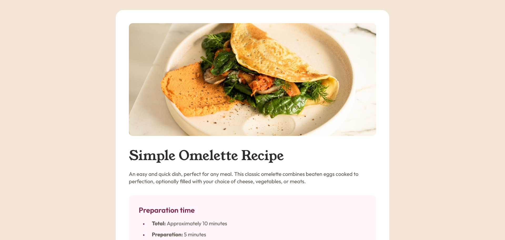

# Frontend Mentor - Recipe Page solution

This project is a solution to the [Recipe page challenge on Frontend Mentor](https://www.frontendmentor.io/challenges/recipe-page-KiTsR8QQKm). These challenges are designed to enhance coding skills through building practical, real-world projects.

## Table of contents

- [Overview](#overview)
  - [Screenshot](#screenshot)
  - [Links](#links)
- [My process](#my-process)
  - [Built with](#built-with)
  - [What I learned](#what-i-learned)
- [Author](#author)

## Overview

### Screenshot

### Links

- Solution URL: [here]()
- Live Site URL: [here]()

## My process

### Built with

- Semantic HTML
- CSS
- Flexbox
- Mobile Version

### What I learned

## Author

- Frontend Mentor - [Vladyslav Shulhach](https://www.frontendmentor.io/profile/Vladyslav-Shulhach)
